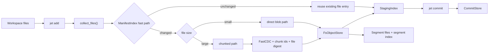
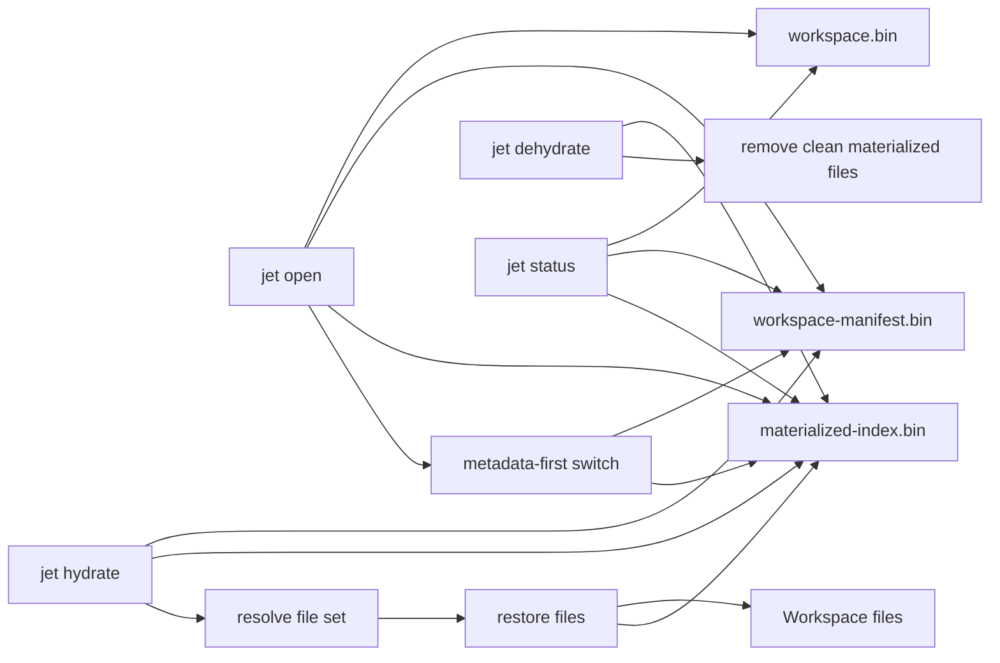
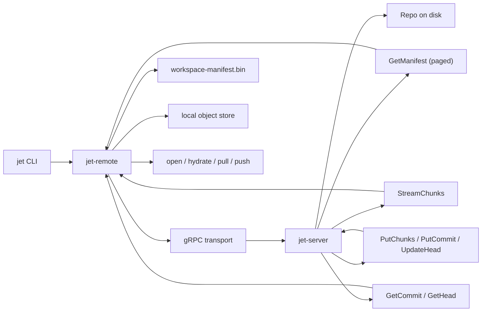
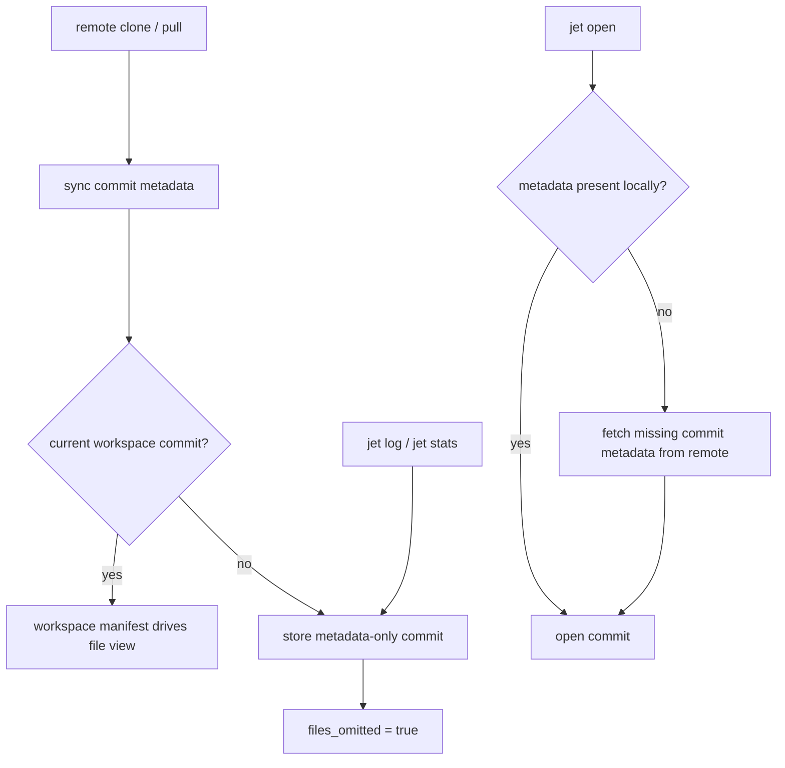
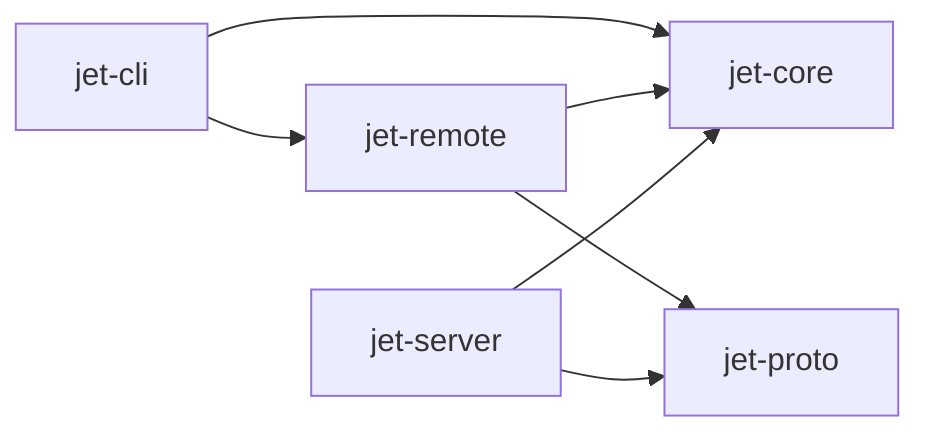

# Jet Current Architecture

This document reflects the current codebase, not the original design target.

The diagrams below are split by concern so the file stays readable:

- local storage and ingest
- local workspace state
- remote sync path
- metadata-only history

## 1. Local Storage And Ingest

Notes:

- small files use the direct blob path
- large files use chunking and then batch object writes
- `jet commit` is light; most work happens during `jet add`

## 2. Local Workspace State

Notes:

- `jet open` does not fully materialize the repo
- the current visible workspace file set lives in `workspace-manifest.bin`
- `materialized-index.bin` tracks `virtual / hydrated / dirty / not-in-view`

## 3. Remote Sync Path

Notes:

- remote clone, pull, open, and hydrate are manifest-first
- remote object transfer is stream-based
- server-side manifest filtering happens before local hydrate/open decisions

## 4. Metadata-Only History

Notes:

- remote history does not need every commit to be fully materialized locally
- older commits can exist as lightweight metadata-only records
- opening an older remote commit can fetch missing metadata on demand

## 5. Crate Boundaries

Notes:

- `jet-core` owns local repo logic
- `jet-remote` owns remote client workflows
- `jet-server` owns service-side RPC handlers
- `jet-proto` owns shared protocol definitions
